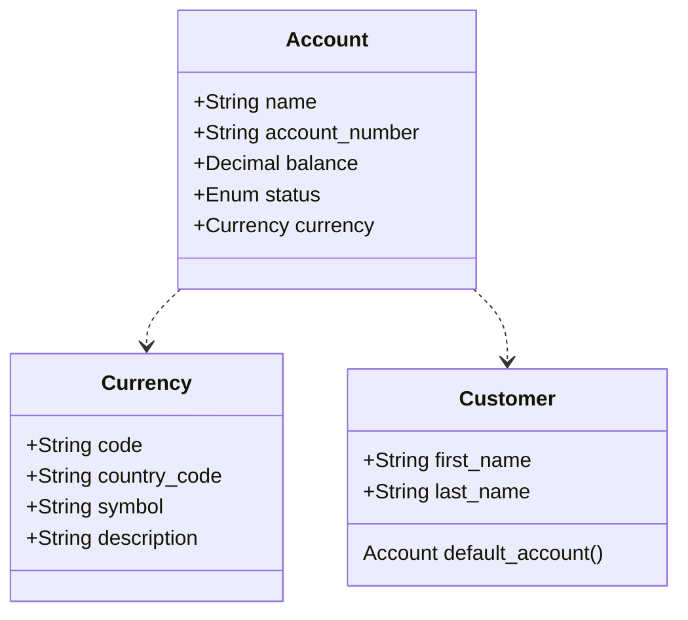
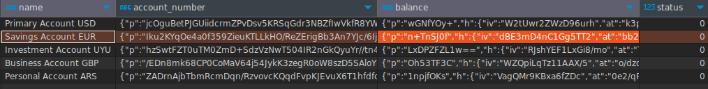

# Moraki Bank Accounts

This project aims to develop a form using Ruby on Rails, Inertia.js, and PostgreSQL to manage multiple bank accounts for a single user. The user is able to perform CRUD actions and select a default account.

## Documentation

### Simplified Class Diagram



### Database Encryption

For security reasons, certain sensitive fields in the accounts (currently `balance` and `account_number`) have been encrypted. The encryption is performed using ActiveRecord Encryption. TDE is [not currently supported](https://github.com/leobz/moraki_bank_accounts/issues/7#issuecomment-2266363087)



## Issue Tracking

For completed tasks, please refer to [this link](https://github.com/leobz/moraki_bank_accounts/issues?q=is%3Aissue+is%3Aclosed).  
For pending tasks that are yet to be implemented, please visit the [open issues](https://github.com/leobz/moraki_bank_accounts/issues?q=is%3Aopen+is%3Aissue).

## Setup

1. Install requirements:
   - Ruby Version: 3.3.4
   - NodeJs Version: > 20
   - Docker Compose

2. Install dependencies

```bash
bundle install
npm install
```

3. Set up ActiveRecord Encryption:

Generate and copy the encryption credentials
```bash
rails db:encryption:init
```

Create a `.env`file and fill it with the generated credentials
```bash
ACTIVE_RECORD_ENCRYPTION_PRIMARY_KEY=your_encryption_primary_key
ACTIVE_RECORD_ENCRYPTION_DETERMINISTIC_KEY=your_encryption_deterministic_key
ACTIVE_RECORD_ENCRYPTION_KEY_DERIVATION_SALT=your_encryption_derivation_salt
```

4. Set up the database

```bash
# Clean old containers
make dc-down

# Create the database, run migrations, and seeds
make setup-db
```

## Run

Execute the application in development mode with a dockerized PostgreSQL database

```bash
make dev
```

The application runs at `http://localhost:3100/`

## Run Tests

1. Start PostgreSQL with the test database

```bash
make run-test-db
```

2. Open another terminal

3. Execute automated tests
```
# Requires PostgreSQL (execute `make run-test-db` in another terminal)
make test
```

---